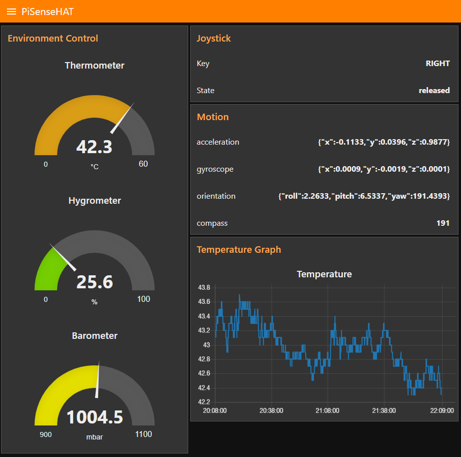
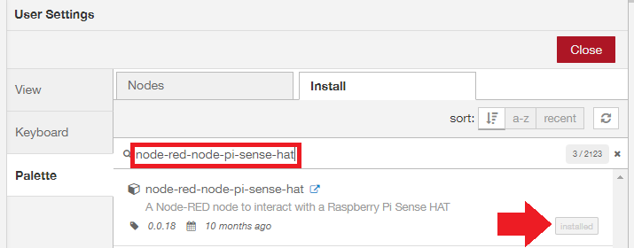
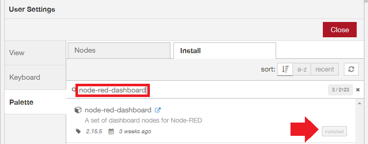
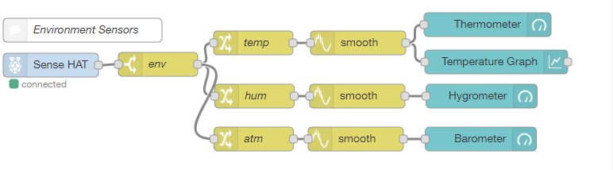
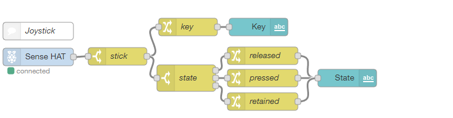
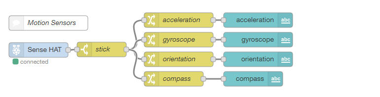
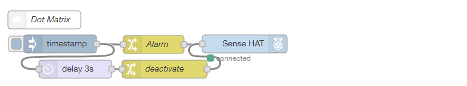

# Raspberry Pi Sense HAT & Node-RED

A [Node-RED](https://nodered.org/) Flow to access the [Sense Hat](https://www.raspberrypi.org/documentation/hardware/sense-hat/) sensors, joystick and dot matrix using the [node-red-node-pi-sense-hat](https://flows.nodered.org/node/node-red-node-pi-sense-hat) node. Follow the instructions below, install all prerequisites and import the given flows into your Node-RED installation using the import dialogue. The Node-RED panel - [how to install Node-RED on a Raspberry Pi](https://nodered.org/docs/getting-started/raspberrypi) - is available under `http://<IP of your Pi>:1880` and the Node-RED Dashboard can be reached with  `http://<IP of your Pi>:1880/ui`:





## Pre-requisites

### Installing Python 3.7.0 on Raspbian

Install the required build-tools:

```bash
sudo apt-get install build-essential tk-dev libncurses5-dev libncursesw5-dev libreadline6-dev libdb5.3-dev libgdbm-dev libsqlite3-dev libssl-dev libbz2-dev libexpat1-dev liblzma-dev zlib1g-dev libffi-dev -y
```

Download and install Python 3.7.0 When downloading the source code:

```bash
wget https://www.python.org/ftp/python/3.7.0/Python-3.7.0.tar.xz
tar xf Python-3.7.0.tar.xz
cd Python-3.7.0
./configure
make -j 4
sudo make altinstall
sudo apt-get install python3-pip
```

### Installing the Sense HAT python drivers

```bash
sudo apt-get update
sudo apt-get install sense-hat
sudo pip3 install pillow
```

Then install the [node-red-node-pi-sense-hat](https://flows.nodered.org/node/node-red-node-pi-sense-hat) node in [Node-RED](https://nodered.org/) and [node-red-dashboard](https://flows.nodered.org/node/node-red-dashboard) from the Palette menu:








## Environment Sensors




```json
[{"id":"1c54a462.f160dc","type":"rpi-sensehat in","z":"cebf2946.36dfa8","name":"","motion":true,"env":true,"stick":true,"x":66,"y":84,"wires":[["d818a011.6e4f6"]]},{"id":"1257186b.0a2a38","type":"change","z":"cebf2946.36dfa8","name":"temp","rules":[{"t":"set","p":"payload","pt":"msg","to":"payload.temperature","tot":"msg"}],"action":"","property":"","from":"","to":"","reg":false,"x":321,"y":56,"wires":[["5286a46a.22574c"]]},{"id":"d818a011.6e4f6","type":"switch","z":"cebf2946.36dfa8","name":"env","property":"topic","propertyType":"msg","rules":[{"t":"eq","v":"environment","vt":"str"}],"checkall":"true","repair":false,"outputs":1,"x":201,"y":83,"wires":[["1257186b.0a2a38","ebc9af3f.8eb3f","6a598f88.a0418"]]},{"id":"f51c664.1c4ff98","type":"ui_gauge","z":"cebf2946.36dfa8","name":"Thermometer","group":"f9412ecc.e353b","order":0,"width":0,"height":0,"gtype":"gage","title":"Thermometer","label":"°C","format":"{{value}}","min":0,"max":"60","colors":["#00b500","#e6e600","#ca3838"],"seg1":"","seg2":"","x":616,"y":33,"wires":[]},{"id":"ebc9af3f.8eb3f","type":"change","z":"cebf2946.36dfa8","name":"hum","rules":[{"t":"set","p":"payload","pt":"msg","to":"payload.humidity","tot":"msg"}],"action":"","property":"","from":"","to":"","reg":false,"x":322.5,"y":123,"wires":[["3f4ce8a5.02ef88"]]},{"id":"6da57f94.3deb2","type":"ui_gauge","z":"cebf2946.36dfa8","name":"Hygrometer","group":"f9412ecc.e353b","order":0,"width":0,"height":0,"gtype":"gage","title":"Hygrometer","label":"%","format":"{{value}}","min":0,"max":"100","colors":["#00b500","#e6e600","#ca3838"],"seg1":"","seg2":"","x":608.5,"y":123,"wires":[]},{"id":"6a598f88.a0418","type":"change","z":"cebf2946.36dfa8","name":"atm","rules":[{"t":"set","p":"payload","pt":"msg","to":"payload.pressure","tot":"msg"}],"action":"","property":"","from":"","to":"","reg":false,"x":321.5,"y":177,"wires":[["dde55c07.3459a"]]},{"id":"c24d86d8.1920a8","type":"ui_gauge","z":"cebf2946.36dfa8","name":"Barometer","group":"f9412ecc.e353b","order":0,"width":0,"height":0,"gtype":"gage","title":"Barometer","label":"mbar","format":"{{value}}","min":"900","max":"1100","colors":["#00b500","#e6e600","#ca3838"],"seg1":"","seg2":"","x":607.5,"y":177,"wires":[]},{"id":"9d96007b.fe3e6","type":"comment","z":"cebf2946.36dfa8","name":"Environment Sensors","info":"","x":106,"y":40,"wires":[]},{"id":"10fe0e9f.a28511","type":"ui_chart","z":"cebf2946.36dfa8","name":"Temperature Graph","group":"398715c2.3c77ea","order":0,"width":0,"height":0,"label":"Temperature","chartType":"line","legend":"false","xformat":"HH:mm:ss","interpolate":"linear","nodata":"","dot":false,"ymin":"","ymax":"","removeOlder":"2","removeOlderPoints":"","removeOlderUnit":"3600","cutout":0,"useOneColor":false,"colors":["#1f77b4","#aec7e8","#ff7f0e","#2ca02c","#98df8a","#d62728","#ff9896","#9467bd","#c5b0d5"],"useOldStyle":false,"outputs":1,"x":627,"y":80,"wires":[[]]},{"id":"5286a46a.22574c","type":"smooth","z":"cebf2946.36dfa8","name":"","property":"payload","action":"mean","count":"10","round":"1","mult":"single","x":453,"y":56,"wires":[["10fe0e9f.a28511","f51c664.1c4ff98"]]},{"id":"3f4ce8a5.02ef88","type":"smooth","z":"cebf2946.36dfa8","name":"","property":"payload","action":"mean","count":"10","round":"1","mult":"single","x":452,"y":123,"wires":[["6da57f94.3deb2"]]},{"id":"dde55c07.3459a","type":"smooth","z":"cebf2946.36dfa8","name":"","property":"payload","action":"mean","count":"10","round":"1","mult":"single","x":450,"y":177,"wires":[["c24d86d8.1920a8"]]},{"id":"f9412ecc.e353b","type":"ui_group","z":"","name":"Environment Control","tab":"55925672.3514d8","disp":true,"width":"7","collapse":false},{"id":"398715c2.3c77ea","type":"ui_group","z":"","name":"Temperature Graph","tab":"55925672.3514d8","disp":true,"width":"10","collapse":false},{"id":"55925672.3514d8","type":"ui_tab","z":"","name":"PiSenseHAT","icon":"dashboard","disabled":false,"hidden":false}]
```


## Joystick




```json
[{"id":"be5d2471.f9a5c8","type":"rpi-sensehat in","z":"cebf2946.36dfa8","name":"","motion":true,"env":true,"stick":true,"x":66,"y":380,"wires":[["91fd80d4.f8a7e"]]},{"id":"45e58bdd.258f74","type":"change","z":"cebf2946.36dfa8","name":"key","rules":[{"t":"set","p":"payload","pt":"msg","to":"payload.key","tot":"msg"}],"action":"","property":"","from":"","to":"","reg":false,"x":321,"y":329,"wires":[["71235304.76b55c"]]},{"id":"91fd80d4.f8a7e","type":"switch","z":"cebf2946.36dfa8","name":"stick","property":"topic","propertyType":"msg","rules":[{"t":"eq","v":"joystick","vt":"str"}],"checkall":"true","repair":false,"outputs":1,"x":201,"y":379,"wires":[["45e58bdd.258f74","aa39462c.4c2d48"]]},{"id":"69a43579.08386c","type":"change","z":"cebf2946.36dfa8","name":"released","rules":[{"t":"set","p":"payload","pt":"msg","to":"released","tot":"str"}],"action":"","property":"","from":"","to":"","reg":false,"x":448,"y":378,"wires":[["b9d6d047.de31e"]]},{"id":"cb6485d.51ede78","type":"comment","z":"cebf2946.36dfa8","name":"Joystick","info":"","x":66,"y":336,"wires":[]},{"id":"71235304.76b55c","type":"ui_text","z":"cebf2946.36dfa8","group":"a6f43e0d.de803","order":0,"width":0,"height":0,"name":"Key","label":"Key","format":"{{msg.payload}}","layout":"row-spread","x":441,"y":329,"wires":[]},{"id":"b9d6d047.de31e","type":"ui_text","z":"cebf2946.36dfa8","group":"a6f43e0d.de803","order":0,"width":0,"height":0,"name":"State","label":"State","format":"{{msg.payload}}","layout":"row-spread","x":592,"y":416,"wires":[]},{"id":"aa39462c.4c2d48","type":"switch","z":"cebf2946.36dfa8","name":"state","property":"payload.state","propertyType":"msg","rules":[{"t":"eq","v":"0","vt":"num"},{"t":"eq","v":"1","vt":"num"},{"t":"eq","v":"2","vt":"str"}],"checkall":"true","repair":false,"outputs":3,"x":318,"y":416,"wires":[["69a43579.08386c"],["67b6251d.62625c"],["9fb965b2.b02958"]]},{"id":"67b6251d.62625c","type":"change","z":"cebf2946.36dfa8","name":"pressed","rules":[{"t":"set","p":"payload","pt":"msg","to":"pressed","tot":"str"}],"action":"","property":"","from":"","to":"","reg":false,"x":448,"y":416,"wires":[["b9d6d047.de31e"]]},{"id":"9fb965b2.b02958","type":"change","z":"cebf2946.36dfa8","name":"retained","rules":[{"t":"set","p":"payload","pt":"msg","to":"held","tot":"str"}],"action":"","property":"","from":"","to":"","reg":false,"x":448,"y":456,"wires":[["b9d6d047.de31e"]]},{"id":"a6f43e0d.de803","type":"ui_group","z":"","name":"Joystick","tab":"55925672.3514d8","disp":true,"width":"10","collapse":false},{"id":"55925672.3514d8","type":"ui_tab","z":"","name":"PiSenseHAT","icon":"dashboard","disabled":false,"hidden":false}]
```


## Motion Sensors




```json
[{"id":"607a3fe8.ab80a","type":"rpi-sensehat in","z":"cebf2946.36dfa8","name":"","motion":true,"env":true,"stick":true,"x":80,"y":595,"wires":[["180e043d.b57f4c"]]},{"id":"180e043d.b57f4c","type":"switch","z":"cebf2946.36dfa8","name":"stick","property":"topic","propertyType":"msg","rules":[{"t":"eq","v":"motion","vt":"str"}],"checkall":"true","repair":false,"outputs":1,"x":208,"y":594,"wires":[["8de22eef.715c2","5981e711.5b2b28","1e544807.614c68","a73fd6c2.608c58"]]},{"id":"8de22eef.715c2","type":"change","z":"cebf2946.36dfa8","name":"acceleration","rules":[{"t":"set","p":"payload","pt":"msg","to":"payload.acceleration","tot":"msg"}],"action":"","property":"","from":"","to":"","reg":false,"x":364,"y":534,"wires":[["75db5c18.2a9e14"]]},{"id":"5981e711.5b2b28","type":"change","z":"cebf2946.36dfa8","name":"gyroscope","rules":[{"t":"set","p":"payload","pt":"msg","to":"payload.gyroscope","tot":"msg"}],"action":"","property":"","from":"","to":"","reg":false,"x":364,"y":574,"wires":[["5e026225.600c5c"]]},{"id":"1e544807.614c68","type":"change","z":"cebf2946.36dfa8","name":"orientation","rules":[{"t":"set","p":"payload","pt":"msg","to":"payload.orientation","tot":"msg"}],"action":"","property":"","from":"","to":"","reg":false,"x":364,"y":614,"wires":[["3b0df56.d5b8b0a"]]},{"id":"a73fd6c2.608c58","type":"change","z":"cebf2946.36dfa8","name":"compass","rules":[{"t":"set","p":"payload","pt":"msg","to":"payload.compass","tot":"msg"}],"action":"","property":"","from":"","to":"","reg":false,"x":354,"y":654,"wires":[["b26451df.fb209"]]},{"id":"75db5c18.2a9e14","type":"ui_text","z":"cebf2946.36dfa8","group":"a6b50040.890f8","order":3,"width":0,"height":0,"name":"","label":"acceleration","format":"{{msg.payload}}","layout":"row-spread","x":525,"y":534,"wires":[]},{"id":"5e026225.600c5c","type":"ui_text","z":"cebf2946.36dfa8","group":"a6b50040.890f8","order":3,"width":0,"height":0,"name":"","label":"gyroscope","format":"{{msg.payload}}","layout":"row-spread","x":525,"y":574,"wires":[]},{"id":"3b0df56.d5b8b0a","type":"ui_text","z":"cebf2946.36dfa8","group":"a6b50040.890f8","order":3,"width":0,"height":0,"name":"","label":"orientation","format":"{{msg.payload}}","layout":"row-spread","x":525,"y":614,"wires":[]},{"id":"b26451df.fb209","type":"ui_text","z":"cebf2946.36dfa8","group":"a6b50040.890f8","order":3,"width":0,"height":0,"name":"","label":"compass","format":"{{msg.payload}}","layout":"row-spread","x":515,"y":654,"wires":[]},{"id":"e5186ff9.17045","type":"comment","z":"cebf2946.36dfa8","name":"Motion Sensors","info":"","x":100,"y":540,"wires":[]},{"id":"a6b50040.890f8","type":"ui_group","z":"","name":"Motion","tab":"55925672.3514d8","disp":true,"width":"10","collapse":false},{"id":"55925672.3514d8","type":"ui_tab","z":"","name":"PiSenseHAT","icon":"dashboard","disabled":false,"hidden":false}]
```


## Dot Matrix




```json
[{"id":"95c31d59.c2426","type":"rpi-sensehat out","z":"cebf2946.36dfa8","name":"","x":404,"y":780,"wires":[]},{"id":"6c9089bd.427848","type":"inject","z":"cebf2946.36dfa8","name":"","topic":"","payload":"","payloadType":"date","repeat":"","crontab":"","once":false,"onceDelay":0.1,"x":100,"y":780,"wires":[["a39867dd.a55e28","2eb53772.695fa8"]]},{"id":"a39867dd.a55e28","type":"change","z":"cebf2946.36dfa8","name":"Alarm","rules":[{"t":"set","p":"color","pt":"msg","to":"white","tot":"str"},{"t":"set","p":"background","pt":"msg","to":"red","tot":"str"},{"t":"set","p":"speed","pt":"msg","to":"5","tot":"str"},{"t":"set","p":"payload","pt":"msg","to":"Alarm","tot":"str"}],"action":"","property":"","from":"","to":"","reg":false,"x":254,"y":781,"wires":[["95c31d59.c2426"]]},{"id":"8eddb3c4.10da5","type":"change","z":"cebf2946.36dfa8","name":"deactivate","rules":[{"t":"set","p":"background","pt":"msg","to":"off","tot":"str"},{"t":"set","p":"payload","pt":"msg","to":"                  ","tot":"str"}],"action":"","property":"","from":"","to":"","reg":false,"x":272,"y":822,"wires":[["95c31d59.c2426"]]},{"id":"2eb53772.695fa8","type":"delay","z":"cebf2946.36dfa8","name":"","pauseType":"delay","timeout":"3","timeoutUnits":"seconds","rate":"1","nbRateUnits":"1","rateUnits":"second","randomFirst":"1","randomLast":"5","randomUnits":"seconds","drop":false,"x":125,"y":822,"wires":[["8eddb3c4.10da5"]]},{"id":"d9461b8c.9107d8","type":"comment","z":"cebf2946.36dfa8","name":"Dot Matrix","info":"","x":74,"y":740,"wires":[]}]
```